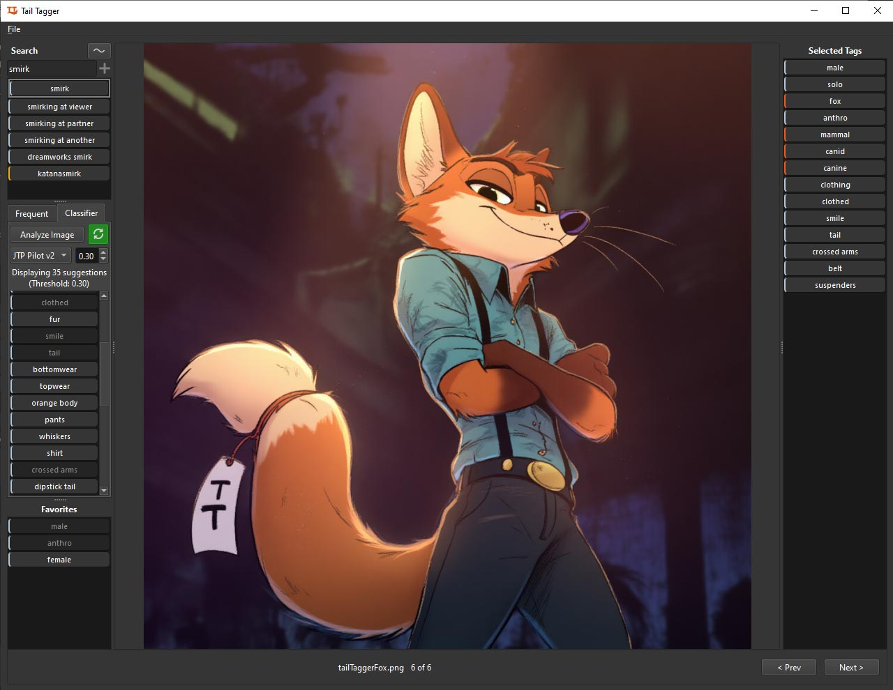

# Tail Tagger

A desktop application built with PySide6 for manual and AI-assisted image tagging, designed for the furry community using the e621 tagging system. Features machine learning model integration for automatic tag suggestions and comprehensive tag management.

This application is HEAVILY inspired by the amazing **[sd-tagging-helper](https://github.com/arenasys/sd-tagging-helper)** application, which I think has a fantastic workflow for manual and AI assisted image tagging. Unfortunately, it does not support more recent, greatly improved image classifiers, limiting the accuracy of AI assisted tagging suggestions. Thus, I created this app, mimicking the workflow and layout, but aimed towards e621 tagging and image classification.



## Features

- **Manual Image Tagging**: Browse and tag images with the comprehensive e621 tag system
- **AI-Assisted Tagging**: Install the JTP models for fast and accurate tag suggestions
- **Tag Management**: Search, favorite, and track frequently used tags. Add new tags to the searchable list
- **Bulk Operations**: Apply tags to all images in a folder at once. Add tags to the beginning or end of every image, or remove tags from the entire dataset.
- **Persistent Data**: Saves in progress work, favorites, and usage statistics

## Installation

### Prerequisites

- Python 3.10 - 3.12
- Git

### Setup

1. **Clone the repository:**
   ```bash
   git clone https://github.com/renfald/tail-tagger.git
   cd tail-tagger
   ```

2. **Run the setup script:**
   ```bash
   # Windows
   setup.bat
   
   # Linux/macOS
   ./setup.sh
   ```

   During setup, you'll be prompted to choose GPU acceleration:
   - **CPU only**: Works on all systems (slowest)
   - **NVIDIA GPU**: Requires NVIDIA GPU with CUDA drivers
   - **AMD GPU** (Linux only): Requires AMD GPU with ROCm drivers

3. **[Optional] Download AI Models:**

   Tail Tagger works perfectly without AI models for manual tagging only. To enable AI-assisted tagging:

   - Visit [RedRocket/JointTaggerProject on Hugging Face](https://huggingface.co/RedRocket/JointTaggerProject)
   - Download model files following instructions in:
     - [`classifiers/JTP_PILOT/DOWNLOAD_INSTRUCTIONS.md`](classifiers/JTP_PILOT/DOWNLOAD_INSTRUCTIONS.md)
     - [`classifiers/JTP_PILOT2/DOWNLOAD_INSTRUCTIONS.md`](classifiers/JTP_PILOT2/DOWNLOAD_INSTRUCTIONS.md)
     - [`classifiers/JTP-3/DOWNLOAD_INSTRUCTIONS.md`](classifiers/JTP-3/DOWNLOAD_INSTRUCTIONS.md) - Latest and most accurate model

That's it! The setup script automatically creates a virtual environment and installs all dependencies.

## Usage

### Running the Application

```bash
# Windows
run.bat

# Linux/macOS  
./run.sh
```

### Basic Workflow

1. **Load Images**: File → Open Folder to select a directory containing images
2. **Navigate**: Use arrow keys or Next/Previous buttons to change selected image
3. **Manual Tagging**:
   - Search for e621-compatible tags in the top left panel
   - Click tags to select/deselect them. You can also use up down arrow keys and enter key. Selected tags appear on the right hand panel
   - Use favorites panel for commonly used tags. Tags can be favorited by clicking the star on the tag
   - Right-click any tag and select Bulk Operations to add or remove the tag across all images in the folder (saves backup in `staging/backups` folder)
4. **AI-Assisted Tagging** (if models installed):
   - Click "Analyze" for intelligent tag suggestions
   - Enable "Auto-Analyze" toggle for automatic analysis on image load
   - Adjust confidence threshold to filter suggestions
5. **Save Work**: Tags are automatically saved as you work
6. **Export**: File → Export Tags to save tag data to .txt file in comma separated format

### Interface Overview

- **Left Panel**: Tag search, frequently used tags, AI classifier controls, favorites
- **Center Panel**: Image display and navigation
- **Right Panel**: Currently selected tags for the active image. Tags can be reordered by dragging up or down

### AI Models

Tail Tagger supports the Joint Tagger Project classifier models trained on furry art:
- **JTP_PILOT**
- **JTP_PILOT2**
- **JTP-3 (Hydra)** - Recommended

Use whichever model(s) you prefer. JTP-3 is recommended for best results.

Models are optional - the app provides full manual tagging functionality without them.

## File Structure

```
├── main.py                   # Main application entry point
├── classifiers/              # AI model directory (download separately)
│   ├── JTP_PILOT/            # JTP_PILOT model files
│   ├── JTP_PILOT2/           # JTP_PILOT2 model files
│   └── JTP-3/                # JTP-3 (Hydra) model files
├── data/                     # Application data (auto-generated)
│   ├── config.json           # User settings
│   ├── favorites.json        # Favorite tags
│   ├── usage_data.json       # Tag usage statistics
│   ├── booru-tags-list.csv   # Master list of booru tags
│   └── e621-tags-list.csv    # Master list of e621 tags
└── staging/                  # Tagging progress saved in staging files
```

## Configuration

Tail Tagger automatically creates configuration files in the `data/` directory:
- **config.json**: Application settings (last folder, model preferences, thresholds)
- **favorites.json**: User's favorite tags
- **usage_data.json**: Tag usage frequency tracking

## Staging

Tail Tagger saves in progress tagging within staging files in the `staging/` directory. Every time you load an image, a staging file will be created and the state of the tags are recorded. You may navigate between images and other folders without losing your work.

When loading an image, the following steps occur:

1. The application checks if a staging file already exists for the image (based on its file path and image name)
2. If a staging file is found, the application loads any selected tags from the staging file
3. If a staging file was not found, the application checks for a .txt file in the same folder using the following patterns:
    - `image_name.txt`
    - `image_name.png.txt` (aka, image name with image extension)
4. If found, it parses for comma separated tags and loads them into a staging file. The application will use the staging file going forward.
5. If no txt. file found or cannot be parsed, a tagging file is created with zero tags selected

For now there is no way to 'reset' the tags back to the original state of a .txt file. If you need that, simply modify the staging file in a text editor.

## Troubleshooting

### Setup Issues

If you encounter problems during setup:

1. **Re-run the setup script** - it will automatically clean up and recreate the environment:
   ```bash
   # Windows
   setup.bat
   
   # Linux/macOS
   ./setup.sh
   ```

2. **Manual cleanup** (if needed):
   ```bash
   # Windows
   rmdir /s /q venv
   
   # macOS/Linux
   rm -rf venv
   ```

### GPU Support

- Tail Tagger automatically detects and uses GPU acceleration if available
- Falls back to CPU if no GPU is detected
- **NVIDIA GPUs**: Ensure compatible CUDA drivers are installed
- **AMD GPUs** (Linux only): Ensure ROCm drivers are installed
- Windows and macOS only support NVIDIA GPU acceleration

### Model Loading Issues

- Ensure model files are placed in the correct directories
- Check `DOWNLOAD_INSTRUCTIONS.md` files in classifier folders
- Restart the application after adding new models
- The app works fine without models for manual tagging

## License

MIT License

## Contributing

You are free to fork the repo, request features/improvements and submit pull requests

## Credits

- AI models provided by [RedRocket/JointTaggerProject](https://huggingface.co/RedRocket/JointTaggerProject)
- Built with PySide6, PyTorch, and other open-source libraries
